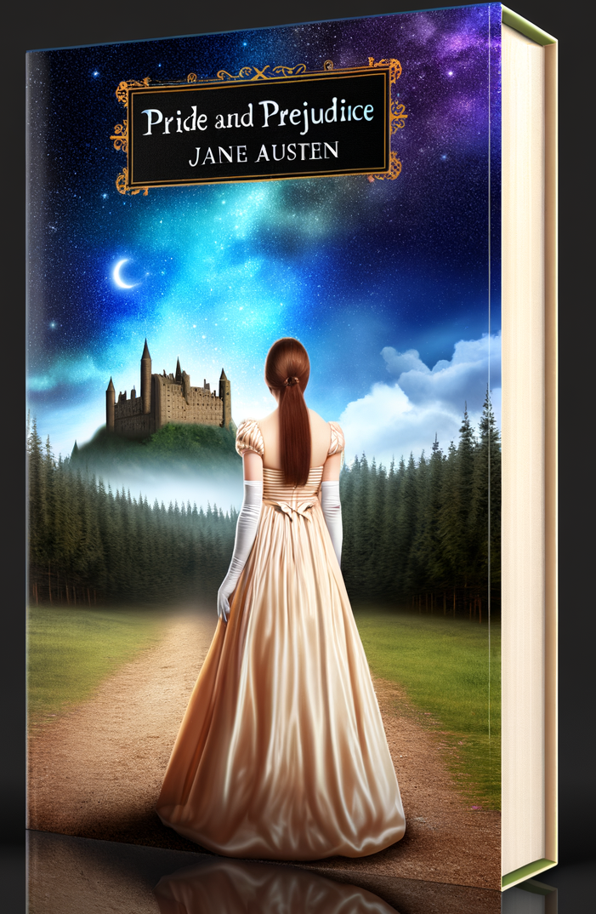

# Alternative media covers

This project uses Stable Diffusion XL (SDXL) from Hugging Face's diffusers library to generate alternative media covers. The generated covers are based on user-defined prompts and initial images.

## Images

### Album cover

| Type        | Before                                    | After                                      |
|-------------|-------------------------------------------|--------------------------------------------|
| Album cover |  |  |
| Book cover  |    |    |
| DVD cover   |      | `    |

